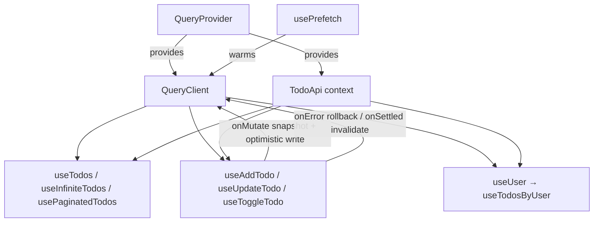

<div align="center">
  

  <h1>react-query-example</h1>

  <p><strong>Production-grade TanStack React Query patterns — typed hooks, infinite & page-based pagination, optimistic updates with rollback, dependent queries, and prefetching.</strong></p>

  <p><em>Built and maintained by Viprasol Tech.</em></p>

  <p>
    <a href="https://github.com/Viprasol-Tech/react-query-example/actions"></a>
    <a href="LICENSE"></a>
    
    
    
    
  </p>
</div>

A small, fully-typed reference for [TanStack React Query](https://tanstack.com/query) v5. Every hook is built over a **pluggable** `TodoApi` interface with an in-memory fake client, so the examples — and their tests — run with **zero network access**. Read the source, copy the patterns, ship them.

## Features

- **Typed query & mutation hooks** — `useTodos()` and `useAddTodo()` with full `Todo[]` inference.
- **Infinite query** — `useInfiniteTodos()` for cursor-based pagination, plus `flattenTodoPages()`.
- **Page-based pagination** — `usePaginatedTodos()` with `next`/`previous`/`goTo`, `keepPreviousData`, and automatic next-page prefetch.
- **Optimistic updates with rollback** — `useToggleTodo()` / `useUpdateTodo()` snapshot the cache, update instantly, and revert on error.
- **Dependent (chained) queries** — `useUser()` → `useTodosByUser()` gated with `enabled`.
- **Prefetching** — `usePrefetch()` warms the cache on hover/focus before mount.
- **Prefix-based invalidation** — hierarchical typed `queryKeys` make targeted cache invalidation predictable.
- **Pluggable API client** — hooks depend on the `TodoApi` interface; the default is an isolated in-memory fake.
- **Real tests** — `vitest` + `@testing-library/react` `renderHook` in jsdom, including rollback and dependent-chain coverage.

## Install

```bash
npm install react-query-example @tanstack/react-query react react-dom
```

## Quickstart

Wrap your app in `QueryProvider`, then call the hooks:

```tsx
import { QueryProvider, useTodos, useAddTodo } from "react-query-example";

function TodoList() {
  const { data, isLoading, error } = useTodos();
  const addTodo = useAddTodo();

  if (isLoading) return <p>Loading…</p>;
  if (error) return <p>Error: {error.message}</p>;

  return (
    <>
      <ul>
        {data?.map((todo) => (
          <li key={todo.id}>{todo.title}</li>
        ))}
      </ul>
      <button onClick={() => addTodo.mutate({ title: "New todo" })}>
        Add todo
      </button>
    </>
  );
}

export function App() {
  return (
    <QueryProvider>
      <TodoList />
    </QueryProvider>
  );
}
```

## Usage

### Infinite scroll / load-more

```tsx
import { useInfiniteTodos, flattenTodoPages } from "react-query-example";

function Feed() {
  const q = useInfiniteTodos({ pageSize: 10 });
  const todos = flattenTodoPages(q.data);

  return (
    <>
      {todos.map((t) => (
        <div key={t.id}>{t.title}</div>
      ))}
      <button
        onClick={() => q.fetchNextPage()}
        disabled={!q.hasNextPage || q.isFetchingNextPage}
      >
        {q.hasNextPage ? "Load more" : "All loaded"}
      </button>
    </>
  );
}
```

### Page-based pagination

```tsx
import { usePaginatedTodos } from "react-query-example";

function Pager() {
  const { query, page, pageCount, hasPrevious, hasNext, previous, next } =
    usePaginatedTodos({ pageSize: 10 });

  return (
    <>
      <ul>{query.data?.items.map((t) => <li key={t.id}>{t.title}</li>)}</ul>
      <button onClick={previous} disabled={!hasPrevious}>Prev</button>
      <span>Page {page + 1} / {pageCount}</span>
      <button onClick={next} disabled={!hasNext}>Next</button>
    </>
  );
}
```

### Optimistic update with rollback

```tsx
import { useToggleTodo } from "react-query-example";

function ToggleButton({ id }: { id: number }) {
  const toggle = useToggleTodo();
  // The UI flips instantly; if the request fails the cache rolls back.
  return <button onClick={() => toggle.mutate(id)}>Toggle</button>;
}
```

### Dependent queries

```tsx
import { useUser, useTodosByUser } from "react-query-example";

function UserTodos({ userId }: { userId: number }) {
  const user = useUser(userId);
  // Only runs once the user has resolved.
  const todos = useTodosByUser(user.data?.id ?? null, user.isSuccess);

  if (!user.isSuccess) return <p>Loading user…</p>;
  return (
    <>
      <h3>{user.data.name}</h3>
      <ul>{todos.data?.map((t) => <li key={t.id}>{t.title}</li>)}</ul>
    </>
  );
}
```

### Prefetching on hover

```tsx
import { usePrefetch } from "react-query-example";

function UserLink({ id, name }: { id: number; name: string }) {
  const { prefetchUser, prefetchTodosByUser } = usePrefetch();
  return (
    <a
      href={`/users/${id}`}
      onMouseEnter={() => {
        void prefetchUser(id);
        void prefetchTodosByUser(id);
      }}
    >
      {name}
    </a>
  );
}
```

### Plugging in a real client

`QueryProvider` accepts your own `TodoApi` and/or `QueryClient`:

```tsx
import { QueryClient } from "@tanstack/react-query";
import { QueryProvider, type TodoApi } from "react-query-example";

const realApi: TodoApi = {
  getTodos: () => fetch("/api/todos").then((r) => r.json()),
  addTodo: (input) =>
    fetch("/api/todos", { method: "POST", body: JSON.stringify(input) }).then((r) => r.json()),
  updateTodo: (id, patch) =>
    fetch(`/api/todos/${id}`, { method: "PATCH", body: JSON.stringify(patch) }).then((r) => r.json()),
  toggleTodo: (id) => fetch(`/api/todos/${id}/toggle`, { method: "POST" }).then((r) => r.json()),
  getTodoPage: (q) => fetch(`/api/todos?cursor=${q?.cursor ?? 0}&limit=${q?.limit ?? 10}`).then((r) => r.json()),
  getUser: (id) => fetch(`/api/users/${id}`).then((r) => r.json()),
  getTodosByUser: (userId) => fetch(`/api/users/${userId}/todos`).then((r) => r.json()),
};

<QueryProvider api={realApi} client={new QueryClient()}>
  {/* ... */}
</QueryProvider>;
```

## API

| Export | Description |
| --- | --- |
| `QueryProvider` | Wraps children with `QueryClientProvider` + API context. Props: `api?`, `client?`. |
| `useTodos()` | Query hook returning `UseQueryResult<Todo[], Error>`. |
| `useAddTodo()` | Mutation that creates a todo, writes it into the cache, and invalidates all todo queries. |
| `useUpdateTodo()` | Optimistic patch (title/completed) with rollback on error. |
| `useToggleTodo()` | Optimistic toggle of `completed` with rollback on error. |
| `useInfiniteTodos(opts?)` | Cursor-based infinite query. Returns `fetchNextPage`, `hasNextPage`, paged `data`. |
| `flattenTodoPages(data)` | Flattens infinite-query pages into a single `Todo[]`. |
| `usePaginatedTodos(opts?)` | Page-based pagination with `next`/`previous`/`goTo`, `pageCount`, and prefetch. |
| `useUser(id \| null)` | Dependent query; idle while `id` is `null`. |
| `useTodosByUser(id, enabled)` | Chained query that runs only when `enabled`. |
| `usePrefetch()` | Memoized `prefetchTodos` / `prefetchUser` / `prefetchTodosByUser` callbacks. |
| `useTodoApi()` | Reads the active `TodoApi` from context (throws outside the provider). |
| `createFakeTodoApi(opts?)` | Builds an isolated in-memory `TodoApi` (`seed`, `users`, `latencyMs`). |
| `queryKeys` | Hierarchical, typed query-key factory for prefix-based invalidation. |

Types `Todo`, `NewTodo`, `TodoPatch`, `TodoApi`, `TodoPage`, `PageQuery`, and `User` are exported for your own client implementations.

## How it fits together



## Development

```bash
npm install
npm run typecheck   # tsc --noEmit (strict)
npm test            # vitest run
npm run build       # tsc -> dist/
```

## Roadmap

- [x] Typed query & mutation hooks
- [x] Infinite query + page-based pagination
- [x] Optimistic updates with rollback
- [x] Dependent queries & prefetching
- [x] Prefix-based cache invalidation
- [ ] Suspense-mode hook variants
- [ ] Offline mutation queue + persistence example
- [ ] Server-side prefetch / hydration recipe

## FAQ

**Does this hit the network?** No. The default `createFakeTodoApi` is fully in-memory, so examples and tests run anywhere. Swap in your own `TodoApi` for real data.

**Why a pluggable `TodoApi` interface?** Hooks depend on the interface, never a concrete client — that makes them trivially testable and lets you switch data sources without touching call sites.

**How does rollback work?** Optimistic hooks snapshot the cache in `onMutate`, apply the change immediately, restore the snapshot in `onError`, and invalidate in `onSettled` to reconcile with the server.

## Contributing

Contributions are welcome. Please read [CONTRIBUTING.md](CONTRIBUTING.md) and our [Code of Conduct](CODE_OF_CONDUCT.md) before opening a pull request.

## Contact — Viprasol Tech Private Limited

- Website: [viprasol.com](https://viprasol.com)
- Email: [support@viprasol.com](mailto:support@viprasol.com)
- Telegram: [t.me/viprasol_help](https://t.me/viprasol_help) | WhatsApp: +91 96336 52112
- GitHub: [@Viprasol-Tech](https://github.com/Viprasol-Tech) | [LinkedIn](https://www.linkedin.com/in/viprasol/) | X [@viprasol](https://twitter.com/viprasol)

## License

[MIT](LICENSE) (c) 2025 Viprasol Tech Private Limited
